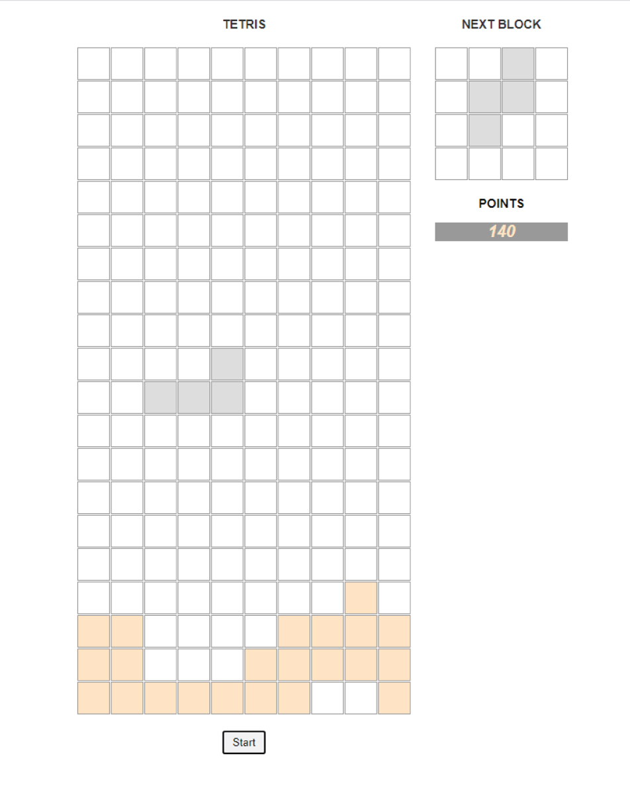

# Tetris

 
 
Hello, here is a new <a href="https://ivanmpr.github.io/Tetris/">project</a> I've been working on recentyly.
Move left and right pressing 'A' and 'D' keys, rotate tetromino by pressing
'W' key, and hard drop the piece by pressing 'S' key. I didn't want to spend
to much time on polishing this project, just basic functionality.
